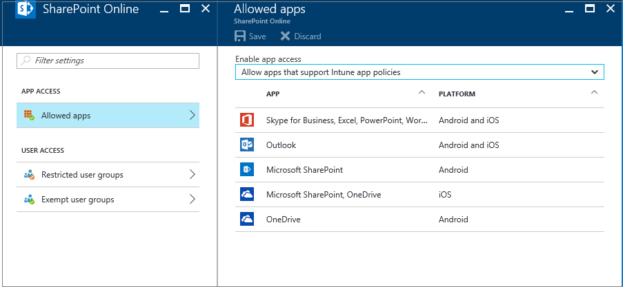

---
# required metadata

title: Create app based conditional access policy for SharePoint Online
description:
keywords:
author: andredm7
ms.author: andredm
manager: angrobe
ms.date: 05/03/2017
ms.topic: article
ms.prod:
ms.service: microsoft-intune
ms.technology:
ms.assetid: 531b09bb-ddfd-498f-8ee3-6675d2466208
ROBOTS: NOINDEX,NOFOLLOW

# optional metadata

#audience:
#ms.devlang:
ms.reviewer: chrisgre
ms.suite: ems
#ms.tgt_pltfrm:
#ms.custom:

---

# Set up app-based conditional access (CA) policies for SharePoint Online

[!INCLUDE[note for both-portals](../includes/note-for-both-portals.md)]

This topic provides guidance on how to set up app-based conditional access policy for SharePoint Online. App-based CA helps admins to only allow mobile apps that have Intune app protection policies applied to.

## To create the app-based CA policy for SharePoint Online

1. Go the [Azure portal](https://portal.azure.com) and sign in with your credentials.

	> [!NOTE]
	> If you're new to the Azure portal experience read the [Azure portal for app protection policies](azure-portal-for-microsoft-intune-mam-policies.md) topic.

2. Choose **More services** from the left menu, then type **Intune** in the text box filter.

3. Choose **Intune App Protection** > **Intune mobile application management** > **All Settings**.

4. On the Intune mobile application management blade, choose the SharePoint Online tile.

5. On the **Allowed apps** blade, choose **Allow apps that support Intune app policies** option to allow only apps that are supported by Intune app protection policies.

	> [!NOTE] 
	> When you select the option to only allow apps that are supported by Intune app protection policies, a list containing **only** the supported apps is displayed.

	

## To assign app-based CA policies to your users

1. Open the **Restricted user groups** blade, then choose **Add user group**.

2. Select one or more user groups that should get this policy.

	

	> [!IMPORTANT] 
	> You may want some users in the user group you selected in the previous step not to be affected by this policy. In such cases, add the group of users to the exempted user groups list. 

3. On the **SharePoint Online** blade, choose **Exempted user groups**, then choose **Add user group** to open the list of user groups.

4. Select the groups you want to exempt from this policy.  

## To modify or delete user groups from an existing app-based CA policy

1. Open the **Restricted user groups** blade, then highlight the user group you want to delete.
2. Click on the ellipse to see the delete options.
3. Choose **Delete** to remove the user group from the list.

> [!NOTE] 
> You can follow the steps procedure to remove a user group from the **Exempted user group** list.

## Next steps

[Block apps that do not use modern authentication](block-apps-with-no-modern-authentication.md)

## See also

[Protect app data with app protection policies](protect-app-data-using-mobile-app-management-policies-with-microsoft-intune.md)

[Configure app-based CA for Exchange Online](mam-ca-for-exchange-online.md)
