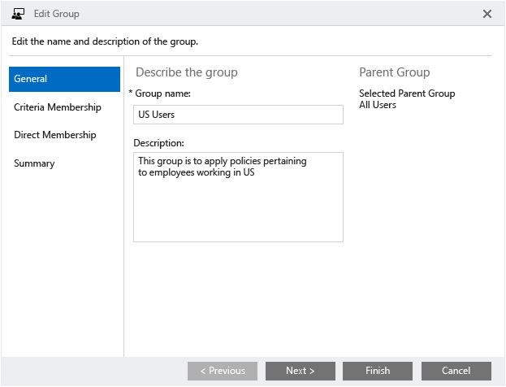
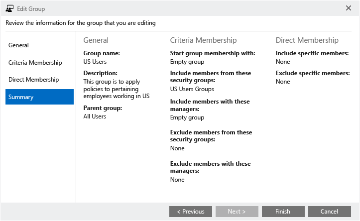
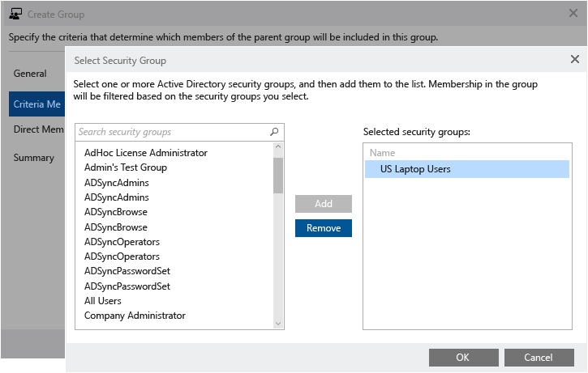
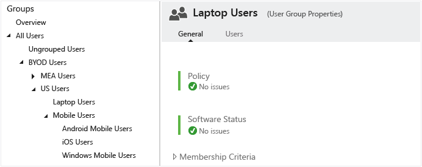
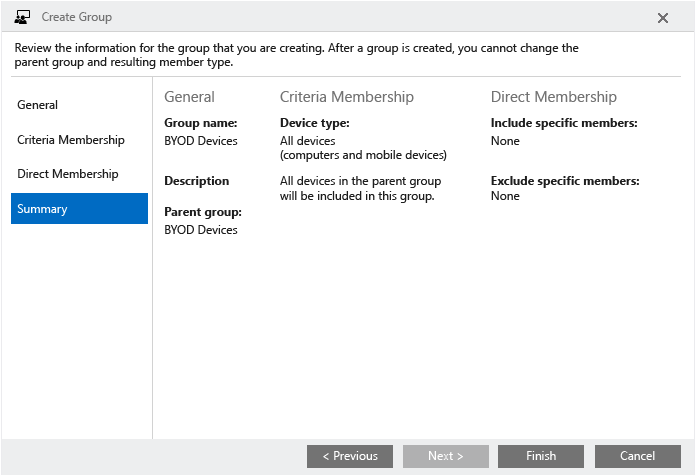
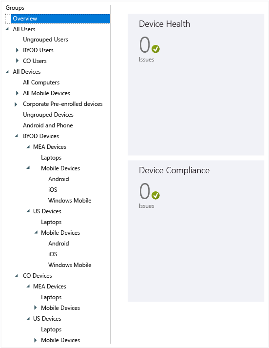

---
# required metadata

title: Plan your user and device groups 
description: Plan groups to meet your organizational needs.
keywords:
author: sanchusa
manager: angrobe
ms.date: 10/25/2016
ms.topic: article
ms.prod:
ms.service: microsoft-intune
ms.technology:
ms.assetid: f11bb256-1094-4f7e-b826-1314c57f3356
ROBOTS: NOINDEX,NOFOLLOW

# optional metadata

#audience:
#ms.devlang:
ms.reviewer: lpatha
ms.suite: ems
#ms.tgt_pltfrm:
ms.custom: intune-classic

---

# Plan your user and device groups

[!INCLUDE[classic-portal](../includes/classic-portal.md)]

Groups in Intune give you great flexibility when you're managing your devices and users. You can set up groups to suit your organizational needs according to:

- geographic location
- department
- hardware characteristics
- operating system
- whether the device is user-owned or company-owned

## How Intune groups work

This is the default view of the **Groups** node in the Intune admin console:

Policies are deployed to groups, so group hierarchy is one of your key design considerations. It's important to know that you cannot change a group’s parent group after you've created the group. How you design your groups is critically important from the moment you start using the Intune service. Some recommended practices for designing a group hierarchy based on your organizational needs are described here.

## Group membership rules

- A group can contain either users or devices, but not both.

    * **Device groups**. This includes computers and mobile devices. Before you can add a computer to a group, it must be enrolled. Before you can add a mobile device to a group, your environment must be configured to support mobile devices, and the device must be enrolled or discovered in Exchange ActiveSync.

    * **User groups**. A group can have users from security groups. Security groups sync with your instance of Active Directory. If you do not sync with Active Directory, you can manually create these groups.

- A device or a user can belong to more than one group.

- A group can include and exclude members based on the following membership rules:

    * **Criteria Membership**. These are dynamic rules that Intune runs to include or exclude members. These criteria use security groups and other information synced with your local instance of Active Directory. When the security group or data changes, the group membership changes when you sync with Active Directory.

    * **Direct Membership**. These are static rules that explicitly add or exclude members. The membership list is static.

-   Active Directory Domain Services (AD DS) is not required when you create user groups or device groups that include users or computers. But, for device groups to include mobile devices, your environment must be configured to support mobile devices.

    Additionally, the devices must be discovered and added to Intune.

## Group relationship rules

- Each group you create must have a parent group. You cannot change a group’s parent group after you've created the group.

- When you add users or devices to a child group:

    * The child group is always a subset of the parent group.

    * New members you add to a child group are automatically added to that group’s parent group.

    * You cannot add a member to a child group when that member is excluded from the parent group.

- The membership of a parent group defines the available membership for the child group.

- When you delete a parent group, all child groups are deleted.

- You can deploy content and policies to a parent group but exclude the deployment to child groups.

- You can add a specific user or device to a child group if the user or device is not already a member of the parent group. If you do this, the new member of the child group will be added to the parent group.

    However, you cannot add a member to a child group if the member is excluded from the parent group.

- Group membership is recursive. For example:

    * **Pat** is a member of only one group, the **Laptop Users** security group.

    * The **Laptop Users** group is a member of the **Approved Users** security group.

    * You create a group in Intune that uses a dynamic membership query that includes the members of the **Approved Users** group. The result is that your Intune user group includes **Pat**.

> [!TIP]
> When you create groups, think about how you will apply policy. For example, you might have policies that are specific to device operating systems, or policies that are specific to different roles or organizational units you've already defined in your Active Directory service. Some admins find it useful to create device groups that are specific to iOS, Android, and Windows. This is in addition to creating user groups for each organizational role.

<!--- should we just link to a policies topic at this point and remove this? Ask Rob
 You'll probably want to create a default policy that applies to all groups and devices, to establish the basic compliance requirements of your organization. Then, you create more specific policies for the broadest categories of users and devices, for example, email policies for each of the device operating systems.

 Be careful when you name your policies, so that you can easily identify them later. For example, a good, descriptive policy name is **WP Email Policy for Entire Company**.

 Each time you create a restrictive policy, you'll want to communicate it to your users. After you create the more general groups and policies, pay attention to how you create smaller groups so that you can reduce unnecessary communication.--->

## Built-in groups
Intune has nine built-in groups that you cannot edit or delete: <!--maybe a screen shot would be best?-->

-   **All Users**
    -   Ungrouped Users
-   **All Devices**
    -   All Computers
    -   All Mobile Devices
        -   All Direct Managed Devices
        -   All Exchange ActiveSync Managed Devices
    -   All Corporate-owned Devices
    -   Ungrouped Devices

> [!NOTE]
> Let your motto be: *keep it simple*. If your organization does not have specific needs like those described in the following sections, keep it simple and go with the default group structure and policies. This will make the service more manageable in the long term. Maintenance will be easier if you can treat your users uniformly. With little differentiation by group, you'll have fewer policies to maintain.

### All users and devices in your organization
Define a parent group for all users and devices in your organization. You are likely to have policies that will apply to all. You can use the Intune default **All Users** and **All devices** groups for this purpose. Sub-groups that organize devices by specifics, like a group for bring your own device (BYOD) and one for corporate-owned (CO) devices, can be child groups of the **All Users** and **All devices** parent groups.

## Customize groups for your organization

### BYOD and corporate-owned devices
If your organization allows employees to use their own devices, provides company-owned devices, or has a combination of both, we recommend that you apply separate policies for these categories of devices.

In the case of BYOD or a mix, be careful to plan policies that do not infringe on local privacy regulations. Create a parent group for all users who will be bringing their own devices. You can use this group to apply policies that are applicable to all users in this category.

Similarly, you can create a group for the CO device users in your organization:

<!---START HERE--->

### Groups for geographic regions
If your organization needs policies for specific regions, you can create groups based on geographic region. You can base them on regional groups that you might have already created in your instance of Active Directory, and sync them with your Azure Active Directory service. You also can create regional groups directly in Azure Active Directory.

The next screenshots show you how to create Intune groups based on groups synced with your on-premises Active Directory instance. These examples assume that you have an Active Directory security group called **US Users Group**.

First, provide general information.

Under **Membership criteria**, select **US Users Group**, synced with Active Directory, as the security group to use under membership rules.

Review your entries, and then choose **Finish** to create the group.

In our example, we’ve also created a group called **MEA**, for the Middle East and Asia.

> [!NOTE]
> If group membership is not populated based on security group membership, make sure that you have assigned Intune licenses to group members.

### Groups for specific hardware
If your organization requires policies that apply to specific hardware types, you can create groups based on this requirement. You can base the policies on specific groups that you have already created in your on-premises instance of Active Directory, and then sync them with Azure Active Directory. You also can create groups directly in Azure Active Directory. In this example, we use **US Users Group** as the parent group for the **Laptop Users** group.

At this point, your group's hierarchy should look similar to the next screenshot. You can see that there are now members in the Intune group **Laptop Users**. Any policies applied to this group will be applied to BYOD laptop users from the U.S. region.

### Groups for specific operating systems
If your organization requires policies that apply to specific operating systems like Android, iOS, or Windows, you can create groups based on this requirement. As in earlier examples, you can base them on OS-specific groups that you have already created in your on-premises instance of Active Directory, and sync them with Azure Active Directory. You also can create them directly in your instance of Azure Active Directory.

By using the same method from earlier examples, you can create groups based on users <!--devices?--> who use specific operating system platforms.

> [!NOTE]
> If you have users who use multiple mobile platforms or operating systems and you do not have an automated way to categorize users as Android users, iOS users, or Windows users, consider applying policies at the device level. This will give you more flexibility to apply policies that are specific to an operating system.
>
> You cannot provision groups dynamically based on the operating system of the device. Instead, do this by using Active Directory or Azure Active Directory security groups.

After all of your user groups are populated based on your organizational requirements, your group hierarchy should look something like this:

You can use this hierarchy to apply the organization's policies.

### Device groups
You also can create similar groups for devices as shown here, starting with a broad group that includes all employee-owned devices, for the BYOD scenario.

Make sure that you select **All devices (computers and mobile)** so that the group will include all BYO devices:

Review your entries, and then choose **Finish** to create the BYOD group.

Continue to create device groups until you have a device group hierarchy that is similar to the user group hierarchy. Your group node in the Intune console will look similar to this:

## Group hierarchies and naming conventions
To make policy management easier, we recommend that you name each policy according to the purpose, platform, and scope to which you apply it. Use a naming standard that follows the group structure that you created when you prepared to apply your policies.

For instance, for an Android policy that applies to all corporate, Android, mobile devices at the U.S. regional level, you might name the policy **CO_US_Mob_Android_General**.

When you name your policies this way, you can quickly identify policies and their intended use and scope in the **Policies** node, like this:

## Next steps
[Create groups](use-groups-to-manage-users-and-devices-with-microsoft-intune.md)
